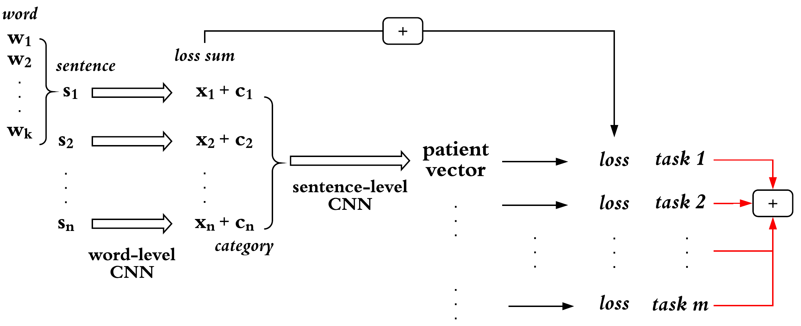

# Multi-task-Learning-via-Clinical-Notes

We developed a deep learning-based model for multi-task learning task from ICU patient clinical notes to predict patient mortality and length of stay. 

This repository contains the code for this project, also contains the [slide](https://github.com/Yuqi92/deep-patient-representation-mimiciii-multitask/blob/master/slide_YS.pptx) and the [paper](https://github.com/Yuqi92/deep-patient-representation-mimiciii-multitask/blob/master/paper.pdf) for more details.

Clinical notes are fetched from a public ICU patient database, also known as MIMIC-III. For more information, like how to get access to the data, please refer to [MIMIC Critical Care Database](https://mimic.physionet.org/gettingstarted/access/).

We don't provide the original data or trained embeddings from MIMIC-III in this repo as it violates the Data Usage Agreement (DUA) of MIMIC-III data. We only provides the instruction for where to download the data: the clinical notes are in the table [NOTEEVENTS.csv](https://mimic.physionet.org/mimictables/noteevents/). The records about admission visits are documented in [ADMISSIONS.csv](https://mimic.physionet.org/mimictables/admissions/), and patient information is in [PATIENTS.csv](https://mimic.physionet.org/mimictables/patients/).

The proposed model in this study, a double-level Convlutional Neural Network (CNN), is illustrated as the following figure:

 <p align="center"></p>
 
Abstracts
=================

We propose a deep learning-based multi-task learning (MTL) architecture focusing on patient mortality predictions from clinical notes. The MTL framework enables the model to learn a patient representation that generalizes to a
variety of clinical prediction tasks. Moreover, we demonstrate how MTL enables small but consistent gains on a single classification task (e.g., in-hospital mortality prediction) simply by incorporating related tasks (e.g., 30-day 
and 1-year mortality prediction) into the MTL framework. To accomplish this, we utilize a multi-level Convolutional Neural Network (CNN) associated with a MTL loss component. The model is evaluated with 3, 5, and 20 tasks and is
consistently able to produce a higher-performing model than a single-task learning (STL) classifier. We further discuss the effect of the multi-task model on other clinical outcomes of interest, including being able to produce high-quality
representations that can be utilized to great effect by simpler models. Overall, this study demonstrates the efficiency and generalizability of MTL across tasks that STL fails to leverage.

Table of Contents
=================

- Environment Setting Up
- Directory Structure
- Demo
- Parameters
- Results
- Contact Information

Environment Setting Up
======================

### Prerequisites

The following instructions are based on Ubuntu 14.04 and Python 3.6, on GPU support.

### Required Environment

There are three options to install required environments for running the project:

1) Manual installation (Not recommended but easier to get a basic overview of required packages):<br />

    a) Install [CUDA toolkit](https://developer.nvidia.com/cuda-toolkit) and corresponding cuDNN(https://developer.nvidia.com/cudnn) for GPU support
    
    b) Install Tensorflow. It is a extremely **tough** experience to install GPU support Tensorflow on Ubuntu but always remember to refer to the [official guidence](https://www.tensorflow.org/install/pip).
    
    ```pip3 install tensorflow ``` and ```pip3 install tensorflow-gpu```
    
    c) Additional packages are needed: logging (tracking events that happen, similar as print) and tqdm (progress bar for better visualize the training) 
    
    ```pip3 install logging``` and ```pip3 install tqdm```

2) Use the [requirements.txt](/requirements.txt):<br />
  
    a) Recommend to use a virtualenv to install all files in the requirements.txt file.
  
    b) cd to the directory where requirements.txt is located.
  
    c) activate your virtualenv.
  
    d) run:  ```pip3 install -r requirements.txt``` in the terminal
  

3) Run the [DockerFile](/Dockerfile):<br />

    a) To get started, you will need to first install [Docker](https://www.docker.com/) on your machine
    
    b) cd to the the directory where Dockerfile is located.
    
    c) run: ```docker build -t imageName:tagName .```, note that you will name your own image and tag
    
    d) now you will have a new image with the imageName you define if you run ```docker image ls```
    
Directory Structure
===================

Please make sure your directories/files are satisfied the following structure before running the code.
```bash
.
├── data
│   ├── index
│   ├── processed_note_file
│   │   ├── p1,p2...p_n.txt
│   │   └──  label.txt
├── results
│   └── models
├── mimic_csv
│   │   ├── NOTEEVENTS.csv
│   │   ├── ADMISSIONS.csv
│   │   └── PATIENTS.csv
├── pre-trained_embedding
│   └──  w2v_mimic.txt
├── tensorboard_tsne
│   ├── tensorboard_log
│   ├── extract_patient_vector.py
│   ├── generate_tsen_data.py
│   └── tensorboard_tsne.py
├── Embedding.py
├── HP.py
├── train.py
├── README.md
├── mimic_preprocessing.py
├── preprocessing_utilities.py
└── utility.py
```


Demo
==========


To get the result in the paper, run throughout the following steps: 

1. Data Preprocessing

    a. Download the mimic note data (.csv) and admission data (.csv)
    
    b. Preprocessing and extracting the mimic note data specific for the project
    
        python3 mimic_preprocessing.py
    
    This will call ```preprocess_utilities.py``` as the utility function.

    The result will generate a pandas dataframe with each patient information one line.


2. Prepare the embedding

    a. Download the pre-trained word embedding 
    
    b. The function of ```load_x_data_for_cnn``` in ```utility.py```is used to load embedding for the model

3. Train the model

    a. The main model is designed in the function of ```CNN_model``` in ```utility.py```
    
    b. Train the model, evaluate and get the report score AUC
            
        python3 train.py   
            

4. Generate tsne visualization

    a. Extract the trained patient vector  

        python3 extract_patient_vector.py
            
    b. Generate tsne data, feature and label

        python3 generate_tsne_data.py

    c. Tensorboard: then open localhost:6006 in a browser

        tensorboard --logdir=/path/to/log --port=6006

Parameters
==========

The hyperparameters for deep learning and other arguments used in the code are all documented in [HP.py](/HP.py). For the future development of this repo, we will introduce [argparse](https://docs.python.org/3.3/library/argparse.html) for inputting parameters.


Results
==========
The performance is evaluated on AUROC score.

1. Performance on single task learning on four tasks:

    | Task        | AUC on single task |
    |-------------|--------------------|
    | In-hospital | 93.90              |
    | 30-day      | 93.05              |
    | 60-day      | 92.32              |
    | 1-year      | 90.39              |
    
2. Performance on multi-task models and report AUC on three related tasks:

    | Multi-task models | In-hospital | 30-day | 1-year |
    |-------------------|-------------|--------|--------|
    | 3-task model      | **94.57**       | **93.24**  | 89.58  |
    | 5-task model      | 94.07       | 93.07  | 90.56  |
    | 20-task model     | 93.41       | 92.35  | **90.59**  |

3. Apply the extracted patient vectors generated from 3-task, 5-task, 20-task models on target task of 60-day prediction:

    |                        | AUC on 60-day mortality task |
    |------------------------|------------------------------|
    | 3-task patient vector  | 91.97                        |
    | 5-task patient vector  | **92.42**                        |
    | 20-task patient vector | 92.12                        |

4. Performance of 3-task model(30-day, 1-year, 6-day LOS) on each related task:

    | Multi-task model                                           | 30-day mortality | 1-year mortality | 6-day LOS |
    |------------------------------------------------------------|------------------|------------------|-----------|
    | 3-task (30-day mortality,1-year mortality,6-day LOS) model | 92.91            | 90.85            | 88.61     |
    
5. Apply the extracted patient vectors generated from 3-task(30-day, 1-year, 6-day LOS) on target task of 14-day LOS:

    |                                                      | AUC on 14-day LOS task |
    |------------------------------------------------------|------------------------|
    | single task model                                    | 89.00                  |
    | 3-task (30-day, 1-year mortality, 6-day LOS) model   | **90.39**                  |
    | 3-task (in-hospital, 30-day, 1-year mortality) model | ~~74.71~~                 |

6. t-SNE on extracted 50-d patient vectors

 <p align="center"></p>


Contact Information
==========
Please contact Yuqi Si (<yuqi.si@uth.tmc.edu>) with questions and comments associated with the code.


